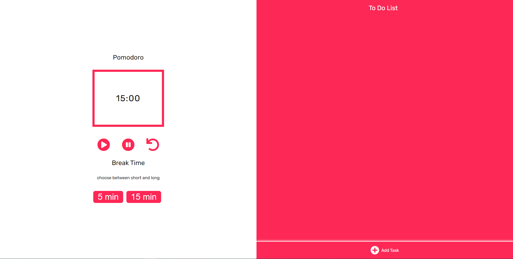

<header> 
<h1 align="center">POMODORO + TODO LIST</h1>
</header>

 <a href="#-sobre-o-projeto">Sobre</a> • 
 <a href="#-tecnologias">Tecnologias</a> • 
 <a href="#-como-contribuir-para-o-projeto">Contribuição</a> •  
 <a href="#autor">Autor</a> •

## 💻 Sobre o projeto

:watch: Inicialmente, o projeto era para ser somente o cronômetro Pomodoro para auxiliar as pessoas em suas tarefas diárias. Mas, senti falta de dizer **quais eram** essas tarefas  e daí surgiu a Todo List como um complemento perfeito.

Projeto _Pomodoro_ desenvolvido no curso **Frontstart** da [Isadora Stangarlin](https://github.com/isadorastan) - [@papodedev - instagram](https://instagram.com/papodedev)

---

## 🛠 Tecnologias

As seguintes ferramentas foram usadas na construção do projeto:

- HTML5
- CSS3
- JavaScript (Client-Side)

## 💪 Como contribuir para o projeto

1. Faça um **fork** do projeto.
2. Crie uma nova branch com as suas alterações: `git checkout -b my-feature`
3. Salve as alterações e crie uma mensagem de commit contando o que você fez: `git commit -m "feature: My new feature"`
4. Envie as suas alterações: `git push origin my-feature`

## Autor
---

  
 <b>Gabriela Menezes</b>:rocket:</a>

Feito com ❤️ por Gabriela Menezes 👋🏽 Entre em contato!

 
